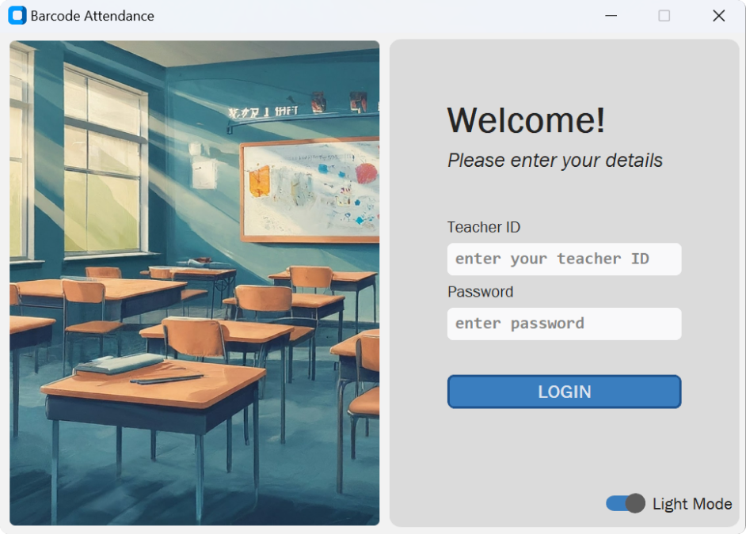
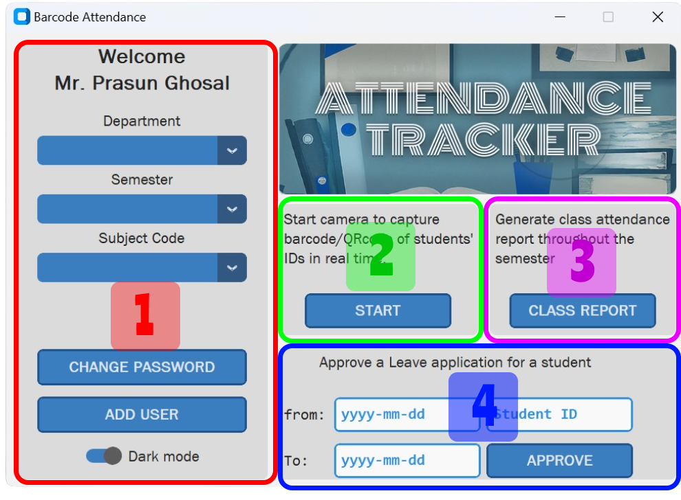

# Attendance Tracking Using Barcode/QRcode

## Contents
- Overview
- Technology Stack
- Methodology
- Future Enhancements
- Appendix

### Implementation
The project aims to automate attendance tracking using barcode and QR code detection. By leveraging Python and OpenCV, the system captures images, processes them to identify codes, which will be nothing but the IDs of students, and logs attendance data automatically, addressing manual inefficiencies in traditional methods of taking attendance and storage issues.

## Technology Stack
### Python
Python is used as the programming language for this project, due to it's relatively easier syntax and availability of a large number of packages and modules to work with, which made the working process easier.

### OpenCV
Popular python image processing package, opencv is used to facilitate the process of reading barcodes and QR codes, including loading an image from disk, grabbing a new frame from a video stream, and processing it.

### Pyzbar
Python library used for decoding and reading various types of barcodes from images or video. It's built on top of the ZBar library, which supports decoding and extracting data from many different barcode formats, including QR codes, EAN-13 barcodes, Code 128 barcodes, and more.

## Methodology
### Login
The user needs to have his credentials in the app's storage. If it's not there, contact the admin.
> 

### Section 1
Before beginning any task, users must first select their `department`, `semester`, and `subject code`. This section also includes an `Add User` feature, which is accessible exclusively to administrators, typically the *Head of Department (HOD)*.

### Section 2
To begin taking attendance, a video will be opened where students will appear one by one to be marked present. This method significantly expedites the attendance process. Once the video successfully decodes a barcode or QR code, the corresponding information will be printed in the console in real time, confirming that the student has been marked as present.
> The addclass UI 

It is understood that each class occurs only once per day. Users can open the video multiple times without encountering any issues, as the system will update any existing data with the most recent attendance records.

### Section 3
To generate a class report, the system saves a copy of the attendance record in CSV format to a specified file directory. This CSV file can be easily opened and managed using MS Excel for further analysis and reporting. This approach ensures convenient access and compatibility with standard spreadsheet applications like Excel.

> A sample snapshot of the file 

### Section 4
This section is exclusively accessible to administrators for approving student leave applications within a specified date range. 
>The approval process involves adding the student to the attendance list for past class dates that fall within this date range. For more detailed information, please refer to the appendix.
